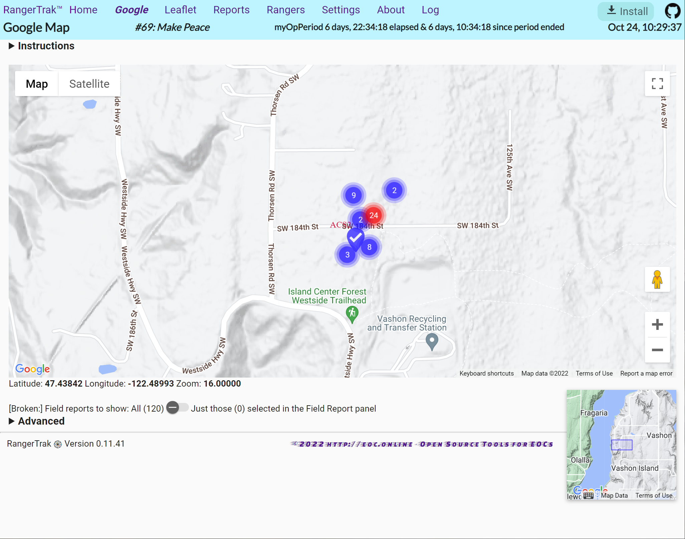
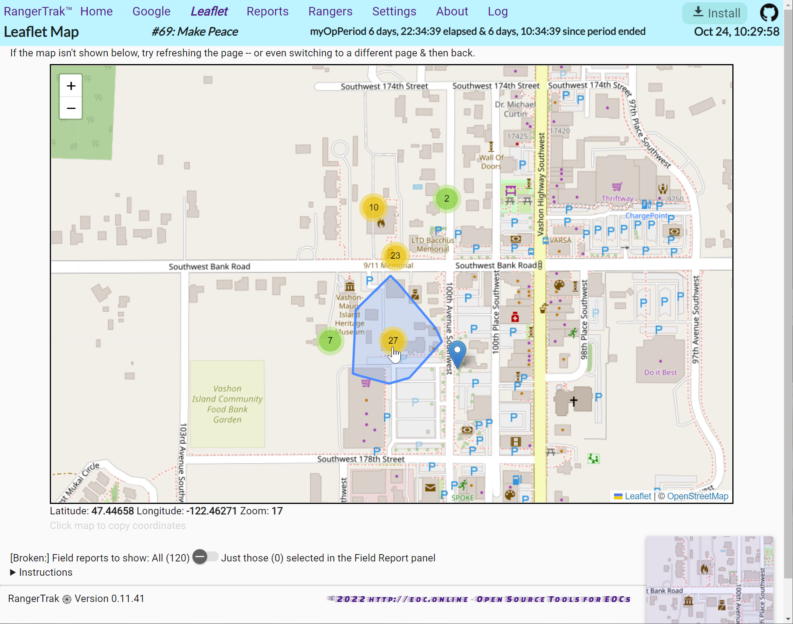
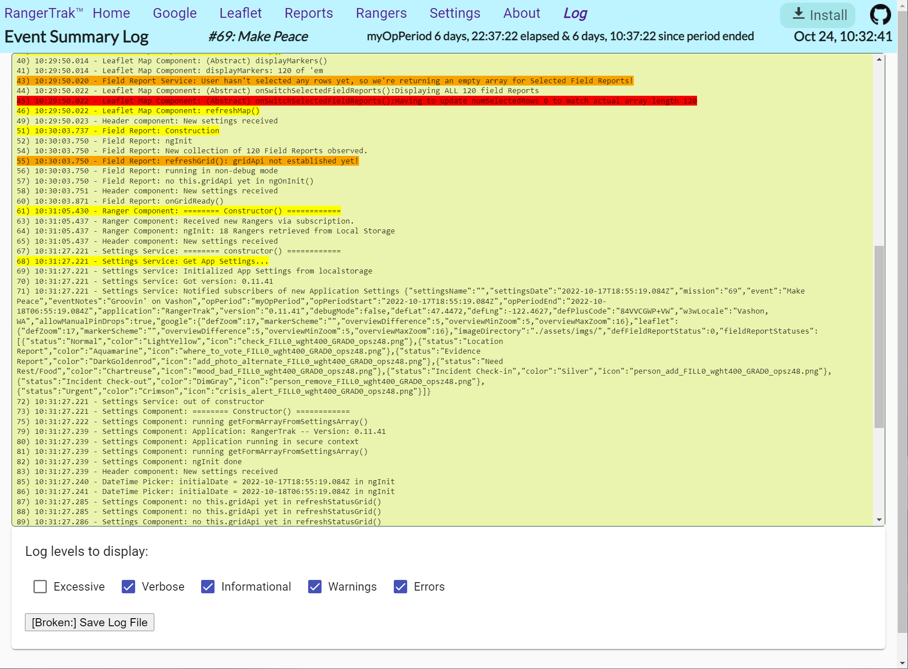

# Rangertrak

This application aids tracking & mapping CERT, ACS, other teams, rangers & individuals roaming around, who are only reliably connected via HAM radio or other non-data supporting means. Teams or individuals can radio in their locations - in a variety of formats, and be centrally tracked. A single log of reports, locations, events and time is created for documentation and analysis. Most critically search area coverage can be determined and teams/individuals that have NOT reported in can be monitored.

This Progressive Web Application (PWA) will largely run even if there is incomsistent, limited, or no cell, internet or data access at the command post.  Rangers can radio in their locations - using a variety of location codes, and be centrally tracked.

Verbally transmitting & transcribing latitude & longitude coordinates can be very error prone and slow. Instead RangerTrak also permits other ways to report locations: by Street Address, Google PlusCodes, and perhaps What3Words. See <https://en.wikipedia.org/wiki/Open_Location_Code#Other_geocode_systems> for a list.

## Features

- Open Source: *free* to use & available to enhance!
- Progressive Web App (PWA) this should be able to function (in the future, possibly with some degredation) even if the person using this at the command post has no or intermittent access to the Internet or cell system.
- Periodic reports can include an editable stsus field and include easily searched notes which can include keywords that make sense locally.
- Tracks mission numbers and names, plus Operational Periods.
- Versions after 0.0.10 are generated with Angular & written in enterprise level Typescript, so will run on most modern web browsers, regardless of device/form factor.
- Supports recording locations as: lat/long (in Decimal Degrees, Degrees Minutes and Seconds, and Degrees and Decimal Minutes), or What3Words, Google +Codes, or physical Street Addresses. Location support may factor in bounding zones or proximity to a locality.
- Lists of reports and rangers can be saved to a CSV (comma seperated value) file for display, documentation and after action analysis - readible by any spreadsheet programs.
- Easy entry via auto-lookup of Ham Radio teams or individuals by tactical callsign.
- Field report statuses can be edited: name & color, future: icon/markers.
- View locations on Google and Leaflet/ESRI maps. (Google has yet to support offline/disconnected mapping, but is working on it for the future.) Maps also have overview/locator maps.
- Rangers can report in as individuals or teams: both are easily edited/sorted/filtered and then only that subset may be exported or displayed on maps.
- Source code documentation uses [https://compodoc.app/guides/jsdoc-tags.html]Compodoc
- Source code is evergreen: current with latest libraries (as of fall 2022)

## Future Roadmap

- To work with out flaws!
- Issues should be moving from a spreadsheet to [the standard Issues Page](https://github.com/EOCOnline/rangertrak/issues)
- Enhance map markers to better highlight paths, teams, statuses.
- Reload data from local files.
- Allow loading of additional map layers (e.g., an image of trails, local features)
  perhaps with <https://github.com/publiclab/Leaflet.DistortableImage>
- improved docs: screenshots and architectural diagrams.
- consider <https://github.com/EventEmitter2/EventEmitter2> for multi-threaded msgs with service workers.
- Optionally publish field reports to a server if Internet access allows: for display at a central EOC or even by participants out in the field with data or cell coverage.

## Items (still) requiring online access

- GeoCoding an address
- All maps (for now)
- 3Word functionality (for now)

## Screenshots & Typical Workflow

So you get an idea of how it looks/works here's a typical workflow. (Click images for larger versions.)

**Mission Settings Screen: Start here!**
At the start of every mission and Op Period, come to this screen and enter mission and operational period parameters and the default location to simplify location entry for each field report. Some mapping parameters can also be adjusted. Field Report statuses can be edited as desired. The background incidentally shows RangerTrak being tested in a real-world exercise.

**Rangers Screen**
**Secondly,** at the start of an Operational Period, come to this screen to enter/edit/record rangers participating. Afterwards this displays Rangers participating in the exercise. This can refer to individuals and/or teams as desired. Rangers can be edited as needed, and optionally exported to a CSV spreadsheet.

Once those initial two steps are complete (i.e., the two screens above), *users will just primarily use the Entry Screen, below, for most of the rest of the exercise or incident.*

**Home (Entry) Screen**
Next is the 'home' or entry screen that allows a 'scribe' to record 'Field Reporrts', i.e., ranger's locations and status reports. Locations can be entered in a variety of formats.
 Screen")

**Google Maps Screen**
This displays Field Reports that have been entered, and optionally a filtered subset of reports.

**Leaflet Maps Screen**
This displays Field Reports that have been entered, and optionally a filtered subset of reports.

**Field Reports Screen**
The next screen displays Field Reports that have been entered, in a table or grid format, with the ability to filter, sort, and search reports on any field. Filtered reports can be mapped or exported to a CSV spreadsheet for documentation or later analysis.

**About Screen**
This provides a bit more explaination about the application, its purpose, technologies used, how to report issues, and license model.

**Logs Screen**
This screen is primarily used for debugging and reporting issues. It can also serve as a partial audit trail of actions taken during the mission.

## To Run

- Simply visit <https://www.RangerTrak.org> and try entering some reports. All data is stored locally in your browser's Local Storage: no tracking codes are used. (Moving to a different browser, or device will provide a 'fresh' RangerTrak environment.) You will have the option to "Install" the application, which just streamlines access with a shortcut. The applicatino takes minimal space and does not run in the background. You can uninstall it like any other app.

## To Build and Test

- Fork Github.com/eocOnline/Rangertrak to your own repository
- Install NodeJS and NPM
- `cd RangerTrak`
- `npm install`
- `ng serve -o`

- or Run `ng serve` for a dev server. Navigate to `http://localhost:4200/`. The app will automatically reload if you change any of the source files.

For production release:
 `npm run build --release` (???)
 `ng build`

## Running unit tests

- Run `ng test` to execute the unit tests via [Karma](https://karma-runner.github.io).
- None currently!

## Running end-to-end tests

Run `ng e2e` to execute the end-to-end tests via a platform of your choice. To use this command, you need to first add a package that implements end-to-end testing capabilities.

- None currently!

## To update documentation

`npm run compodoc` to regenerate the doc.
`compodoc -s` to serve/view the doc at `http://127.0.0.1:8080/`
See <https://compodoc.app/guides/usage.html> and <https://compodoc.app/> for details

## To update Version

stage any changes (or add '--allow-empty' to the following), then
`git commit -m "Release-As: 0.11.40"`
which *SHOULD* (but doesn't) update version # in Package.json & Package-lock.json
Some details in service/settings.service.ts & app.component.ts
<https://github.com/googleapis/release-please#how-do-i-change-the-version-number>

## To Deploy to Google Firebase

This got WAY to complex with Google's recent security upgrades. Now I just FTP it to https://RangerTrak.org

OLD:
`ng deploy`
`ng add @angular/fire`
From Angular Projects, 2nd ed. pg 119
See angular.json and firebase.json

## Architecture

## Further help

To get more help on the Angular CLI use `ng help` or go check out the [Angular CLI Overview and Command Reference](https://angular.io/cli) page.

## eoc.online

<http://eoc.online> provides free tools for Emergency Operations Centers and local CERT/VOAD/Citizen Corps groups. For more information check out <http://eoc.online> & to report issues please visit <https://github.com/EOCOnline/rangertrak>.

©2022 eoc.online, under the MIT License

## Testimonials

---
>  (We) all agreed that this is a WOW program with high value added to SAR.  I really hope you continue to refine it!

— Michael Meyer, Vashon ACS, KB7MTM
